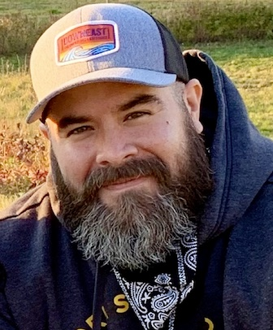

{ width=200 align=right }

# About Me

I'm a Brooklyn native currently residing in New York.  I am passionate about connecting with people and enjoy engaging in friendly conversations and making new acquaintances.  Traveling and immersing myself in different cultures is an absolute pleasure for me.  It has made me more open-minded, appreciative of what we have, and a proponent of embracing cultural influences from other regions.

I am a helpful individual who finds joy in working on collaborative projects.  I wilfully impart and share information with others to help them become successful.  Or volunteer my time and energy to help someone out.  It's fulfilling to contribute to a project or team's success and see the impact of my efforts.

??? info "Traveling"
    - :flag_ec: Ecuador (Guayaquil, Crucita, Manta, Portoviejo, Mindo, Quito) - _**Family connection**_
    - :flag_ec: The Galapagos Islands (San Cristobal, Santa Cruz)
    - :flag_mx: Mexico (Quintana Roo, Chichen Itza)
    - :flag_jm: Negril, Jamaica
    - :flag_do: Punta Cana, Dominican Republic
    - :flag_fr: France (Paris, Honfleur, Arromanches-les-Bains, Mont Saint Michel)
    - :flag_fi: Helsinki, Finland

??? info "Entertainment"
    - :material-movie-open: Movies
        - The Goonies
        - Lord of the Rings and The Hobbit movies
        - Alien & Predator movies
        - Mad Max: Fury Road
        - Top Gun: Maverick
    - :material-television-classic: Series
        - The Office
        - Modern Family
        - Tom Clancy's Jack Ryan
        - The Mandalorian
        - Stranger Things
    - :athletic_shoe: Sports
        - :football: New York Giants
        - :baseball: New York Yankees
        - :hockey: New York Islanders

