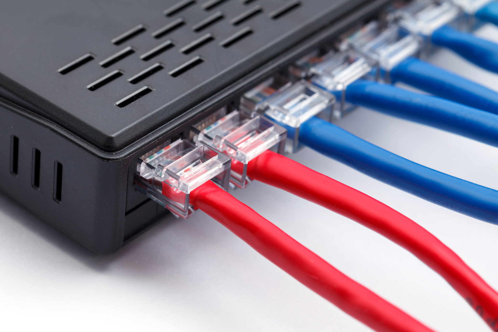
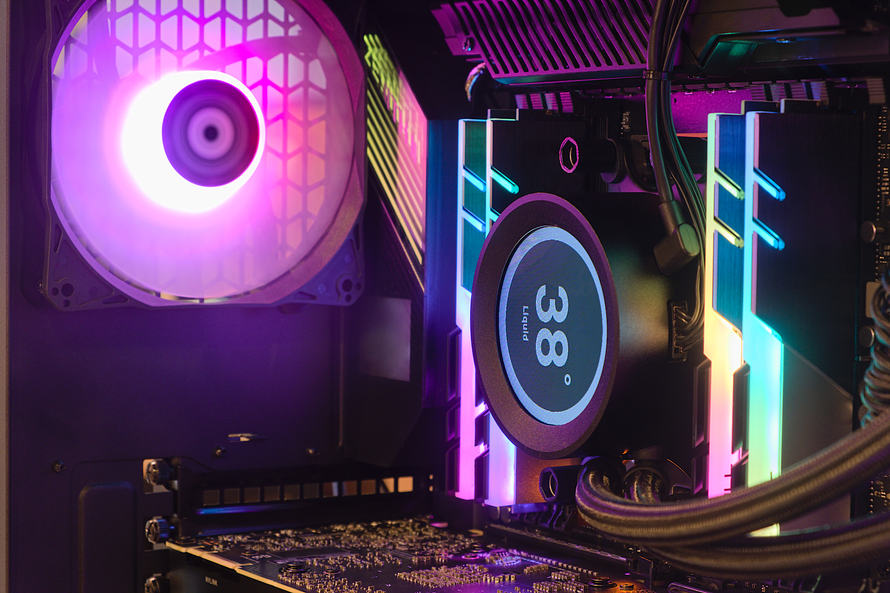

{ width=200 align=right }

# Self-sufficiency through learning

We live in extraordinary times thanks to technology. The world's knowledge is at our fingertips. This convenient accessibility has sparked a passion for learning new crafts and skills.
    

## Home Network

{ width=200 align=right }

When we first moved in, boosting the WiFi signal in our home became a priority when we discovered its weakness on the side opposite where the previous homeowners installed the modem and router. After doing some research, I repurposed an old Asus RT-N66U router that I was no longer using, into a Wireless Access Point, effectively extending the reach of our WiFi throughout the house.

* I installed new networking wallplates and CAT5e connectors all over the house.
* I personally crimped CAT5e cables and ran them discreetly through walls and the attic, connecting the main router to the designated location of the WAP.
* I flashed the firmware on the RT-N66U router and installed DD-WRT software, configuring it to operate in Wireless Access Point (WAP) mode.
* I achieved seamless connectivity while roaming throughout the house by using the identical SSID and security settings as the upstream router, allowing wireless devices to connect to whichever WiFi source is stronger effortlessly.
  

{ width=200 align=right }

## Build Windows Desktop

I've always wanted to build my own Windows desktop, and being stuck at home during the pandemic gave me the perfect opportunity to finally do it.
<!--      -->

* After a bunch of research, I settled on a price range and configuration, and gathered all the parts I needed from Newegg, Micro Center, and Amazon. 
* Once I had everything, I spent a whole day reading tutorials and watching tech YouTubers to figure out how to build my machine. 
* When I finally finished the build, it was such a cool moment to see the lights come on for the first time. I'll never forget that feeling of joy.
* I also found this awesome software called Symless Synergy that lets me use my desktop's keyboard and mouse to control both my Windows desktop and my Macbook. It also supports clipboard sharing, which is super convenient.
* Now I can easily code in both Windows and MacOS environments.
