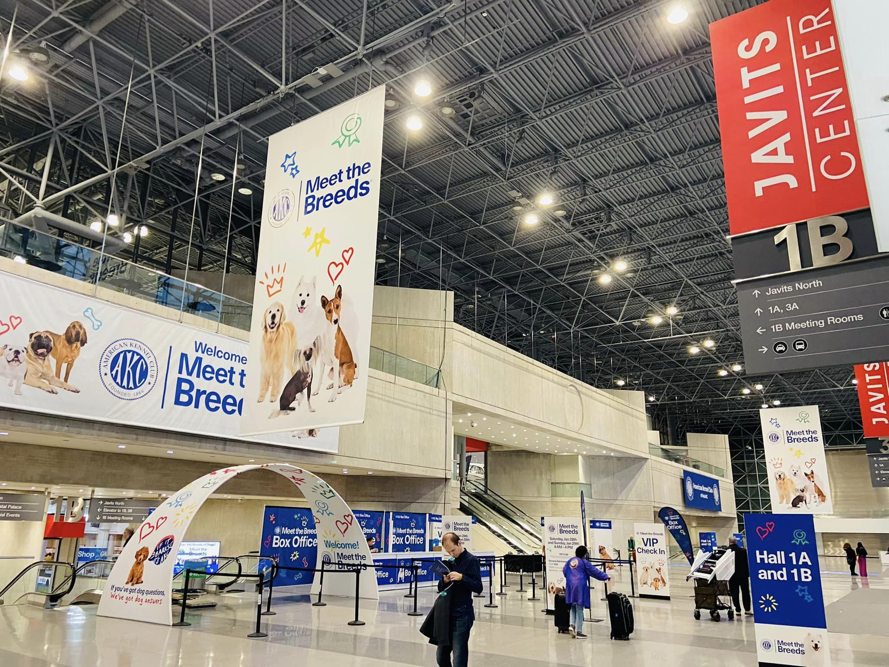
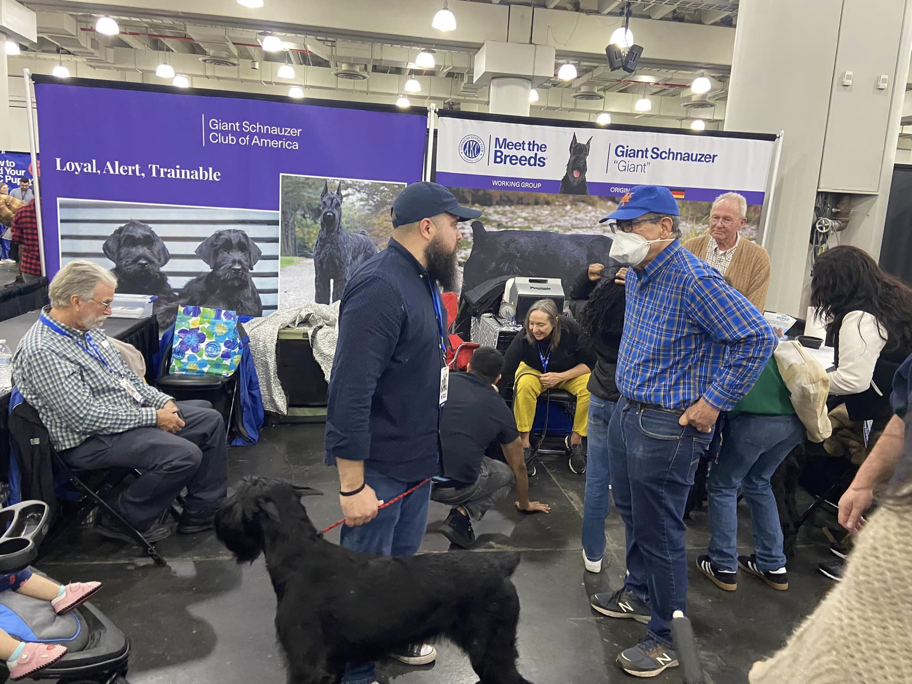
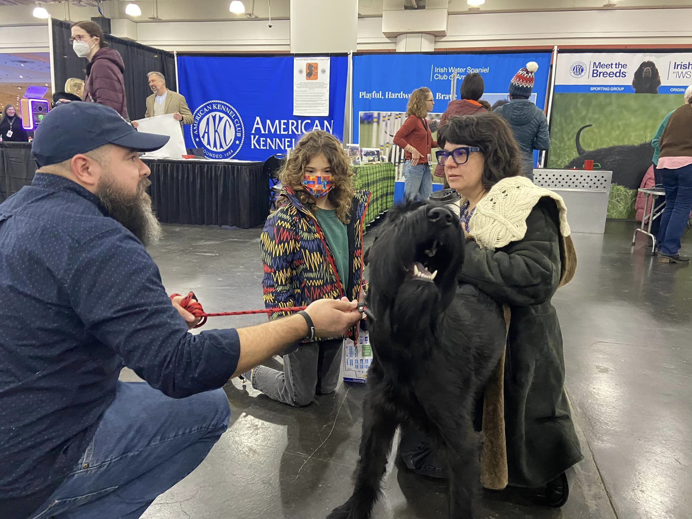
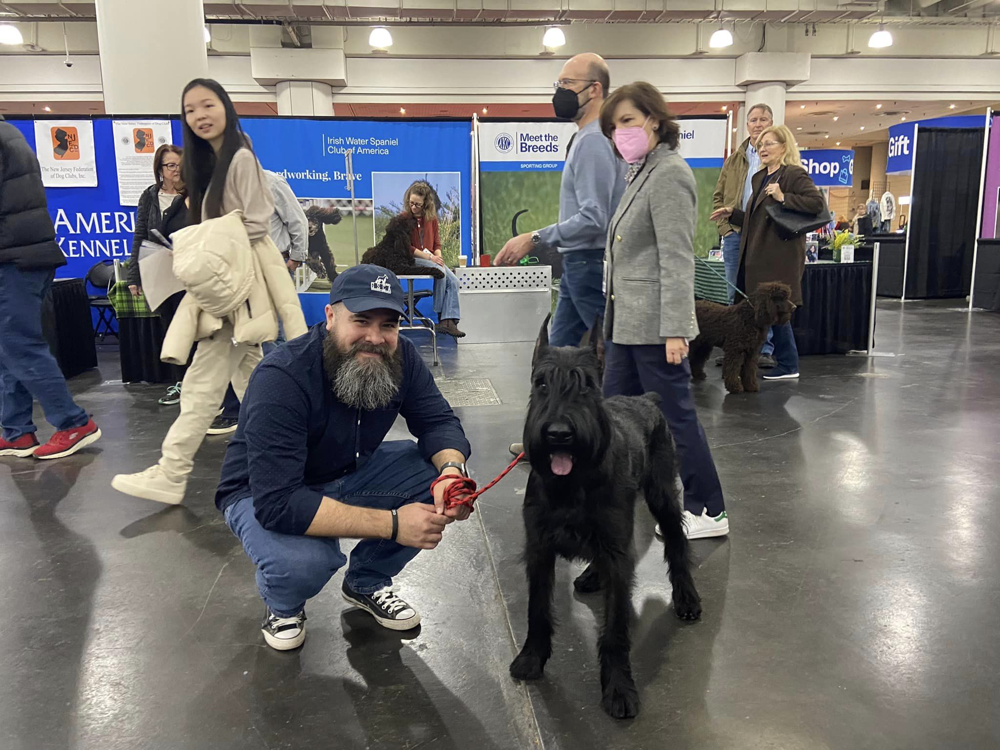
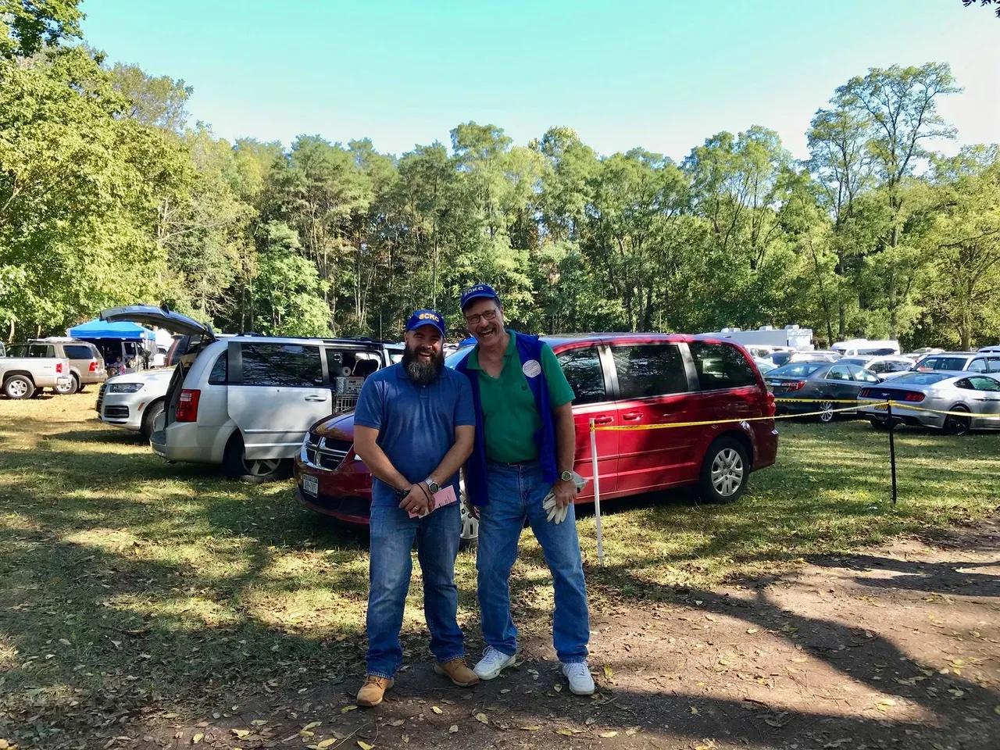
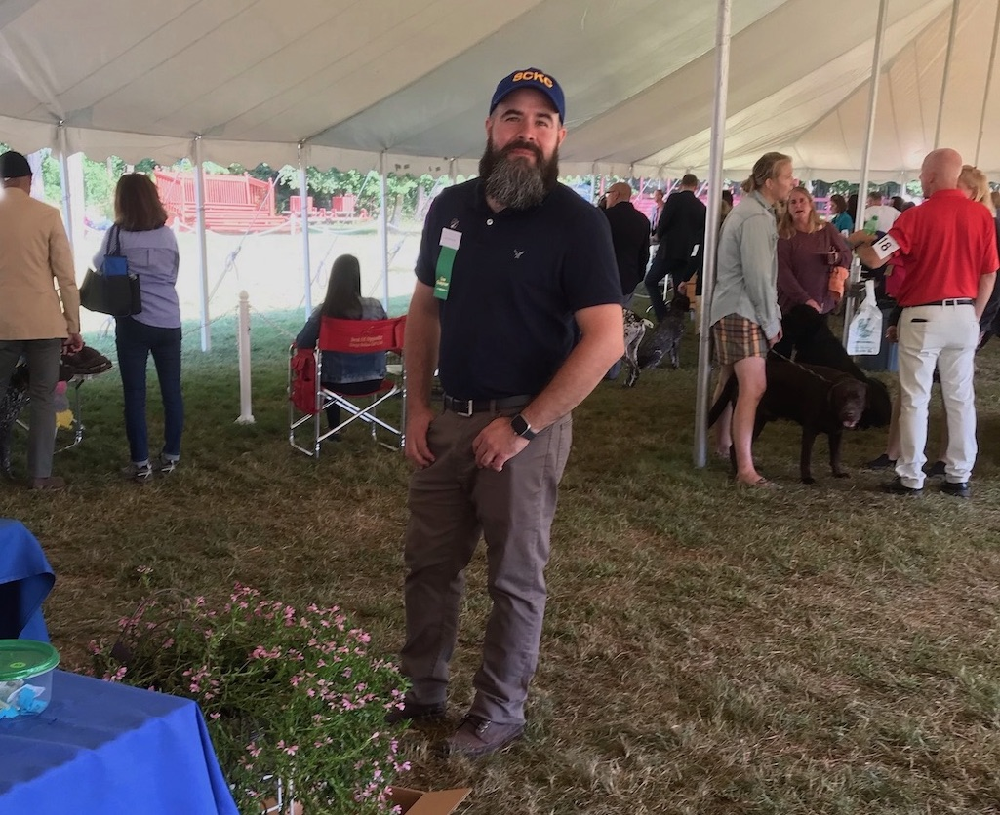
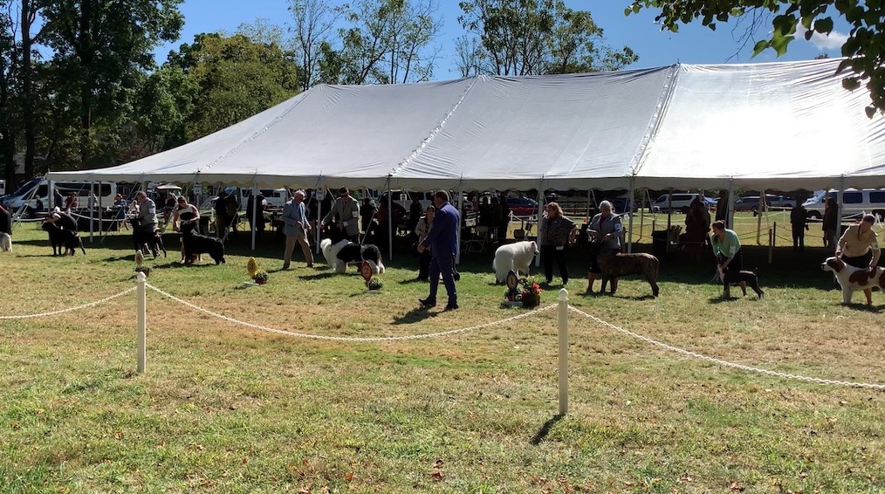
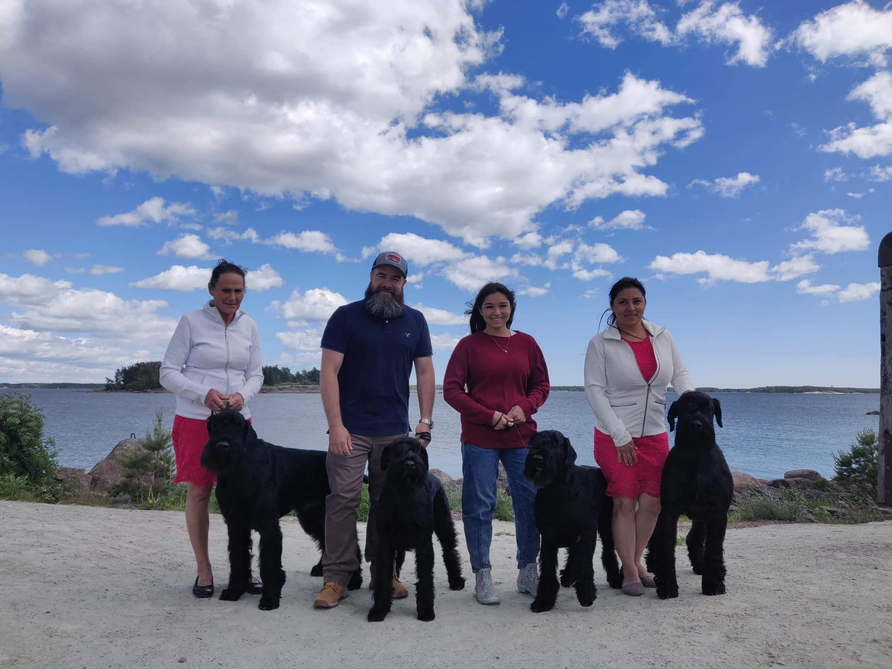
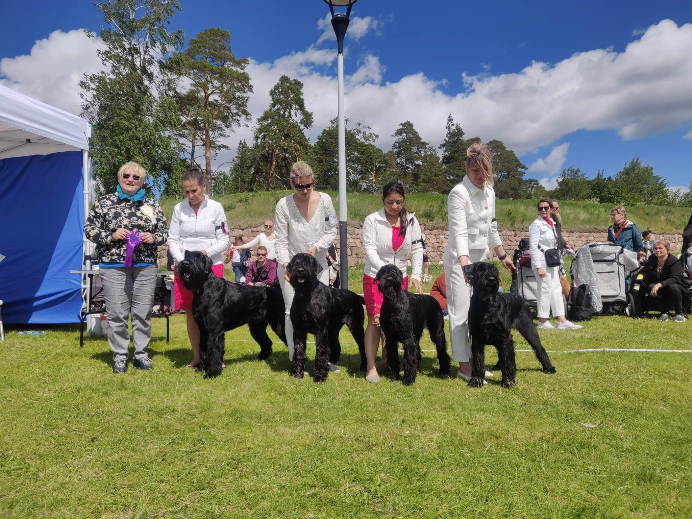

# AKC Breed Parent Clubs and Local Clubs

My wife and I are passionate about dogs.  We breed and show Giant Schnauzers in AKC conformation events.  We have several dogs with Championship titles living across the globe.  Our goal is to have a top winning national dog title, and to compete at [Westminster](https://www.westminsterkennelclub.org/) and the [AKC Royal Canin National](https://www.akc.org/sports/conformation/national-championship/) events.  Additionally, we **actively engage with our local community by volunteering** to host matches and educational seminars.  We are **dedicated members of multiple organizations**, furthering our commitment to the welfare and betterment of dogs.

| Club                            | Role                                     | Links                     |
|---------------------------------|------------------------------------------|---------------------------|
| Giant Schnauzer Club of America | North Eastern Regional Director          | [GSCA Regional Directors](http://www.giantschnauzerclubofamerica.com/Regional-Directors.aspx)
| Suffolk County Kennel Club      | 2nd Vice President / Point Show Chairman | [SCKC Club Officers](https://suffolkcountykennelclub.org/officers) |
| Big Apple Working Group Club    | Member                                   | [BAWG AKC Club Listing](https://www.apps.akc.org/apps/club_search/index_master.cfm?action=refresh_index&active_tab_row_A=1&active_tab_col_A=1&fixed_tab=1&club_id=7366)

## 2023 AKC Meet the Breeds at Jacob Javits Center

My wife and I **proudly represented the Giant Schnauzer breed at the 2023 AKC Meet the Breeds event hosted at the Jacob Javits Center**, where we brought along our own dogs. The show attracted over 10,000 visitors that weekend, and our stall saw hundreds of enthusiastic attendees eager to learn more about our beloved breed.

{ width=300 }
{ width=300 }
{ width=300 }
{ width=300 }

## SCKC All-breed Shows

We actively contribute to our community's local dog show, devoting our time to its planning, setup, and operation as dedicated volunteers. In fact, I have **served as the Point Show Chairman for the past three years**, overseeing its successful execution.

{ width=300 }
{ width=276 }
{ width=580 }

## International Dog Show at Finland

Through our involvement as breeders, we have **forged numerous meaningful friendships and established valuable connections on an international scale**. Among our dear companions, we have developed close bonds with individuals hailing from diverse countries such as Mexico, Canada, and Finland. In this particular photograph, my family and I are visiting our cherished friend Sissy from Stablemaster Kennels. Sissy, who proudly owns two of our puppies, has graciously invited us to **assist her in showcasing her dogs at an esteemed international show in Finland**.

