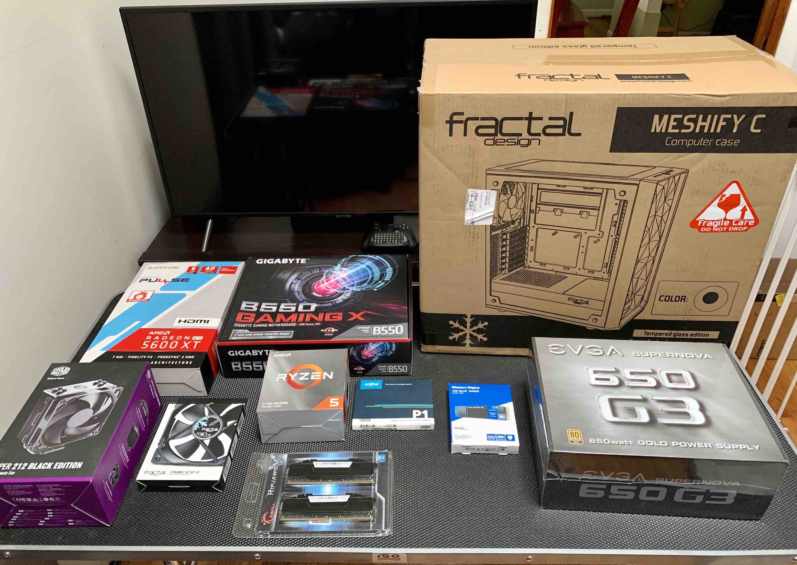
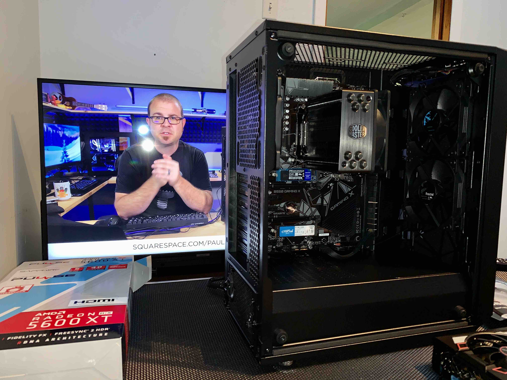
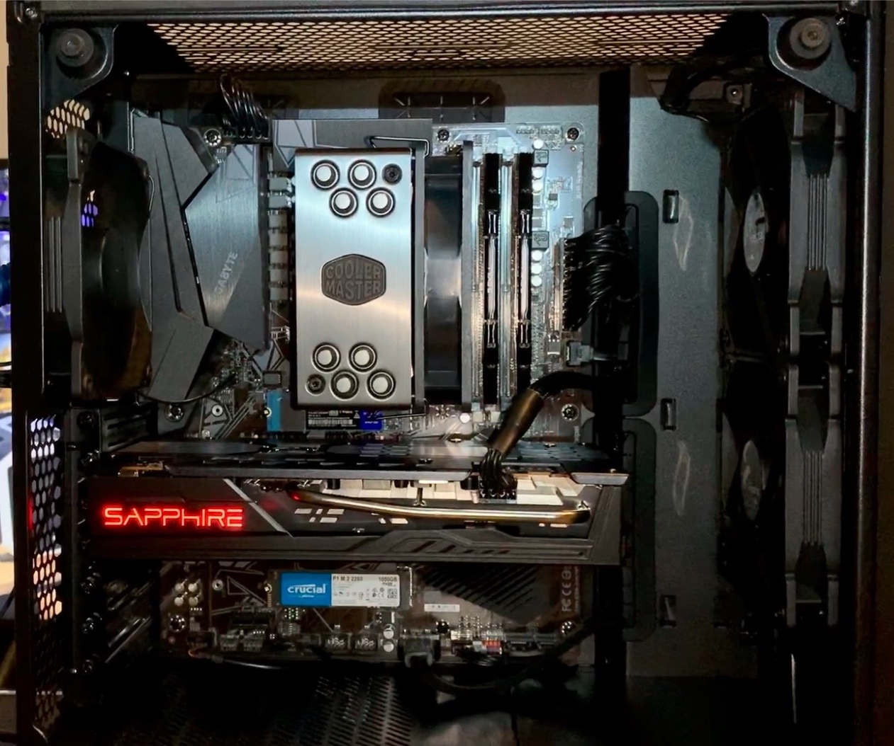

# Windows Desktop Build

I've always wanted to build my own Windows desktop, and being stuck at home during the pandemic gave me the perfect opportunity to finally do it.

* After a bunch of research, I settled on a price range and configuration, and gathered all the parts I needed from Newegg, Micro Center, and Amazon. 
{ width=400 }

* Once I had everything, I spent a whole day reading tutorials and watching [tech YouTubers](https://www.youtube.com/watch?v=i5jFXl0GZJo) to figure out how to build my machine.  
{ width=400 }

* When I finally finished the build, it was such a cool moment to see the lights come on for the first time. I'll never forget that feeling of joy.  
{ width=400 }

* I also found this awesome software called [Symless Synergy](https://symless.com/synergy) that lets me use my desktop's keyboard and mouse to control both my Windows desktop and my Macbook. It also supports clipboard sharing, which is super convenient.

* Now I can easily code in both Windows and MacOS environments.

## Specs

| Part Type     | Details                                                                             |
|---------------|-------------------------------------------------------------------------------------|
| CPU           | AMD Ryzen 5 3600                                                                    |
| CPU Cooler    | Cooler Master Hyper 212 Black Edition                                               |
| Motherboard   | Gigabyte B550 GAMING X                                                              |
| Memory        | G.Skill Ripjaws V 32 GB (2 x 16 GB) DDR4-3600                                       |
| Storage (SSD) | Western Digital Blue SN550 250GB NVMe Internal SSD                                  |
| Storage (SSD) | Crucial P1 1TB 3D NAND NVMe PCIe Internal SSD                                       |
| Storage (HDD) | Seagate BarraCuda ST2000DM008 2TB 7200 RPM 256MB Cache SATA 6.0Gb/s 3.5" Hard Drive |
| Video Card    | Sapphire Radeon RX 5600 XT 6 GB PULSE                                               |
| Case          | Fractal Design Meshify C ATX Mid Tower Case                                         |
| Power Supply  | EVGA 650 W 80+ Gold Certified Semi-modular ATX Power Supply                         |
| Fan           | Fractal Design Dynamic X2 GP-12 Computer Fan 120mm                                  |