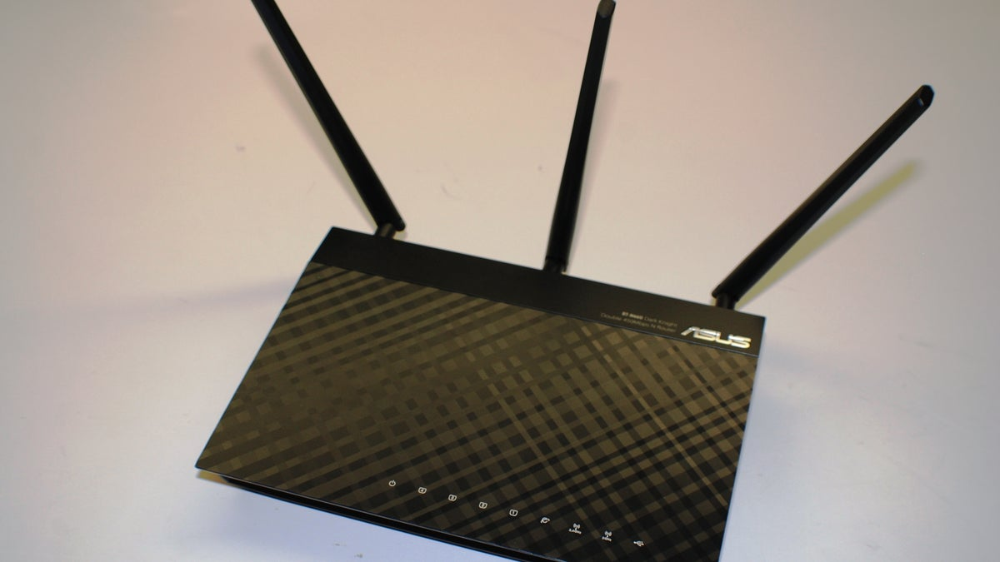

# Home Network

When we first moved in, boosting the WiFi signal in our home became a priority when we discovered its weakness on the side opposite where the previous homeowners installed the modem and router. After doing some research, I repurposed an old Asus RT-N66U router that I was no longer using, into a Wireless Access Point, effectively extending the reach of our WiFi throughout the house.

* I installed new networking wallplates and CAT5e connectors all over the house.
* I personally crimped CAT5e cables and ran them discreetly through walls and the attic, connecting the main router to the designated location of the WAP.
* I flashed the firmware on the RT-N66U router and installed [DD-WRT software](https://forum.dd-wrt.com/wiki/index.php/Asus_RT-N66U), configuring it to operate in Wireless Access Point (WAP) mode.
* I achieved seamless connectivity while roaming throughout the house by using the identical SSID and security settings as the upstream router, allowing wireless devices to connect to whichever WiFi source is stronger effortlessly.

## Tech

* [Asus RT-N66U](https://www.techspot.com/products/routers/asus-rt-n66u-dual-band-wireless-n900-gigabit-router.83325/)
* [DD-WRT](https://dd-wrt.com/)